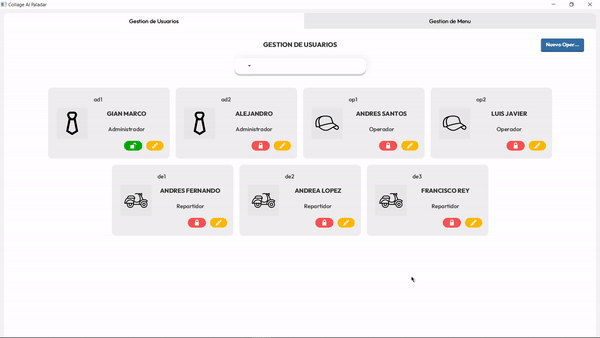
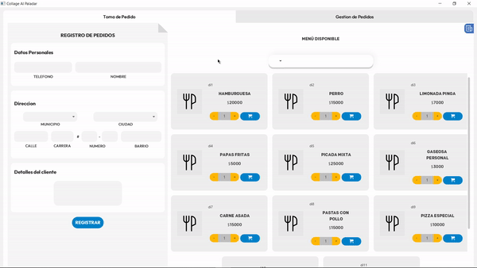
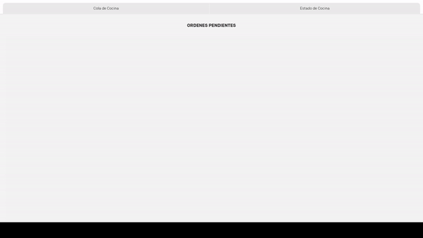

# Collage Al Paladar

This is a university project developed as a team with my partner, [@Alejo-Rodri](https://github.com/Alejo-Rodri), for the subject of Data Structures. It is about a distributed system using RMI for a restaurant.

## Admin Module

  

## Operator Module

  

## Kitchen Module

  

